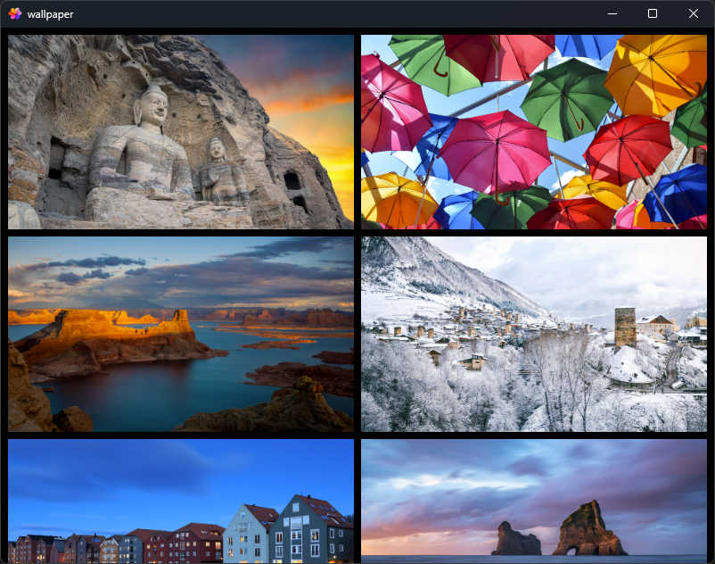

# Wallpaper

Wallpaper 是一款使用 Tauri 开发的轻量级壁纸软件，旨在为用户提供简洁、高效的壁纸管理体验。该软件通过对接 Bing 每日壁纸接口，自动获取并更新每日精选壁纸，帮助用户轻松设置桌面背景。

## 功能特性

- **每日壁纸自动更新**：通过 Bing 每日壁纸接口，自动获取并更新每日精选壁纸。
- **轻量级设计**：基于 Tauri 开发，软件体积小，运行速度快，占用系统资源少。
- **简洁易用**：界面简洁，操作简单，用户可以轻松设置壁纸。



## 开发

### 前提条件
- [Rust](https://www.rust-lang.org/tools/install)
- [Node.js](https://nodejs.org/)
- [Tauri CLI](https://v2.tauri.app/zh-cn)

### 安装步骤

1. 克隆项目到本地：

   ```bash
   git clone https://github.com/ylei2024/wallpaper.git
   ```

2. 进入项目目录：

   ```bash
   cd wallpaper
   ```

3. 安装依赖：

   ```bash
   npm install
   ```

4. 启动开发服务器：

   ```bash
   npm run tauri dev
   ```

5. 构建项目：

   ```bash
   npm run tauri build
   ```
